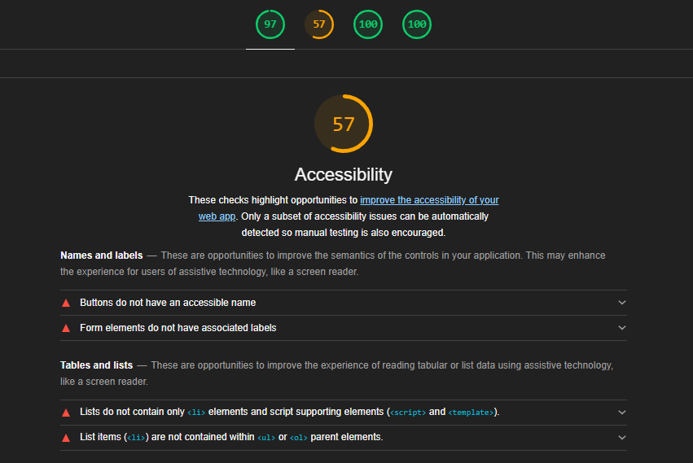
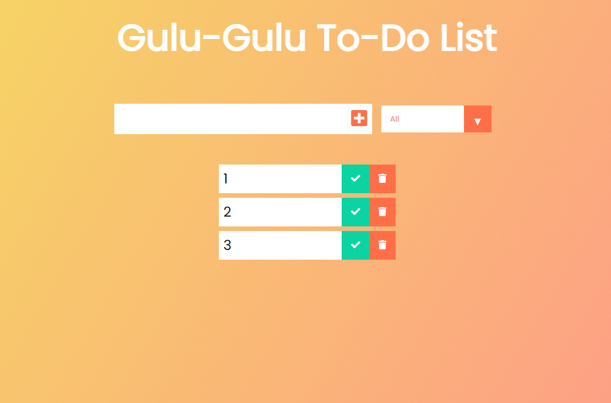

# React Todo Practice
>Following a tutorial by Dev Ed in order to run through the motions of a To Do - but in React.

[View Deployed Application Here.](https://pythonidaer.github.io/ReactToDoPRACTICE/)

## Installation
1. Watch the Tutorial for full Installation Instructions.
2. git clone SSH
3. `npm install` - install React 
4. `npm start` - see if it runs locally

## Usage
This repo was practice for React Todo. I want to go back and break down what was learned, so I can read documentation and build more React stuff solo.

If you follow along with the credited tutorial, you will learn about some of these topics:
- React
- Components
- Folder/File Structure
- Props
- State
- useState
- useEffect
- localStorage `(JSON.Stringify, JSON.parse, getItem, setItems)`
- React Developer Tools
  
## Credits
[Dev Ed is Amazing -- Todo App With REACT](https://www.youtube.com/watch?v=pCA4qpQDZD8)

[favicon.io for turning a free coffee png into a favicon!](https://favicon.io/favicon-converter/)

## License
I've chosen an MIT License. Do what you'd like with this material.

#### Designed for a Quick React Tutorial, so Note Poor Accessibility Ranking

#### I Coded this at my Favorite Cafe - The Gulu Gulu!

## Contact:
You can email me at codefolio.work@gmail.com
